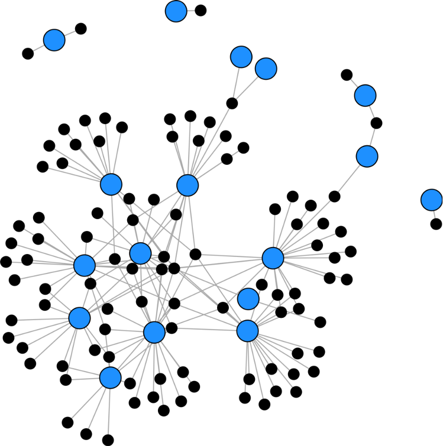

# Hello!

I'm Tad. I use laboratory microcosms and field together together with quantitative modeling and machine learning approaches to address a diverse set of questions in population, community, and disease ecology. I am currently a postdoc with [Alan Hastings](http://two.ucdavis.edu/~me/), where we are working to understand how species interactions influence population dynamics, spatial spread, and geographic range limits.

Feel free to [contact me](mailto:tdallas@ucdavis.edu)

<a class="btn" href="resources/DallasCV.pdf"><i style="color:DimGray" class="fa fa-file-text-o fa-2x"></i></a>

<a class="btn" href="https://github.com/taddallas" ><i style="color:DimGray" class="fa fa-github fa-2x"></i></a>

<a class="btn" href="https://scholar.google.com/citations?user=baoGwQ0AAAAJ&hl=en" ><i style="color:DimGray" class="ai ai-google-scholar ai-2x"></i></a>

<a class="btn" href="http://orcid.org/0000-0003-3328-9958" ><i style="color:DimGray" class="ai ai-orcid ai-2x"></i></a>

<a class="btn" href="http://stackoverflow.com/users/4190082/tad-dallas"><i style="color:DimGray" class="fa fa-stack-overflow fa-2x"></i></a>

 
 
