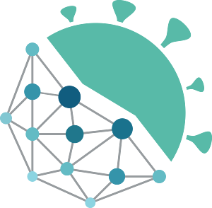

# Dallas Lab

We are a group of theory-minded folks who use a combination of laboratory microcosms, applied mathematics, and machine learning to understand ecological systems. We love studying ecological networks, macroecology, and infectious disease. 

Please reach out if you are interested in joining the lab here at University of South Carolina. More information on lab policies and my mentoring philosophy can be found on the [lab Github](https://github.com/dallasLab).

Feel free to [contact me](mailto:tad.a.dallas@gmail.com)

